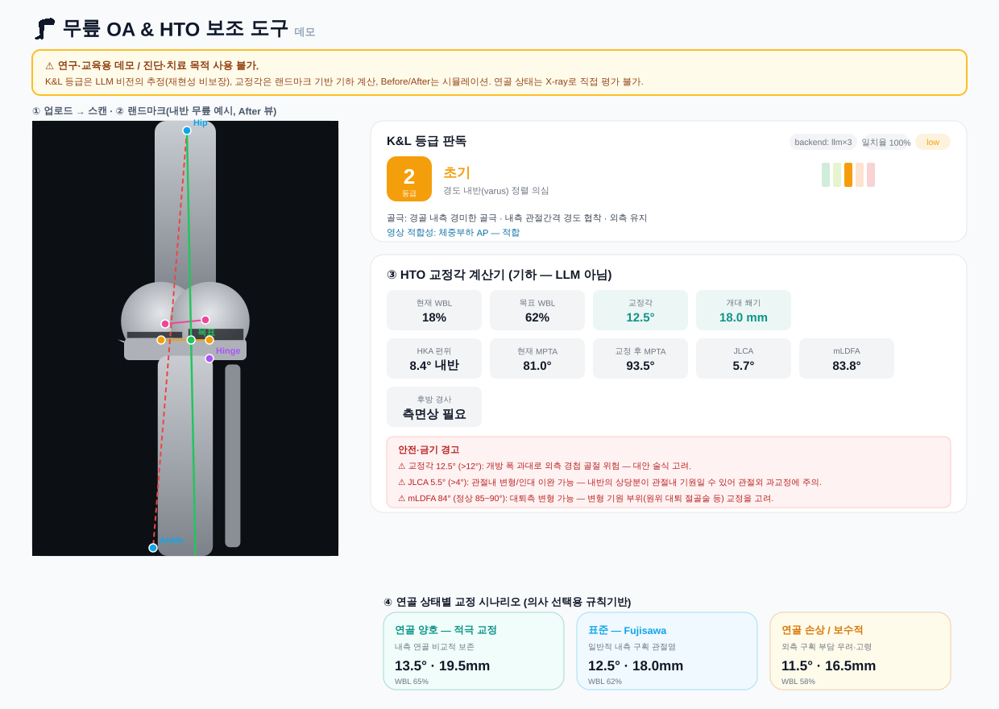

This is a [Next.js](https://nextjs.org) project bootstrapped with [`create-next-app`](https://nextjs.org/docs/app/api-reference/cli/create-next-app).

## Getting Started

First, run the development server:

```bash
npm run dev
# or
yarn dev
# or
pnpm dev
# or
bun dev
```

Open [http://localhost:3000](http://localhost:3000) with your browser to see the result.

You can start editing the page by modifying `app/page.tsx`. The page auto-updates as you edit the file.

This project uses [`next/font`](https://nextjs.org/docs/app/building-your-application/optimizing/fonts) to automatically optimize and load [Geist](https://vercel.com/font), a new font family for Vercel.

## 무릎 OA & HTO 보조 도구 (데모) — `/xray`

무릎 X-ray의 K&L 등급을 추정하고 HTO 교정각을 계산하는 **연구·교육용 데모**입니다.

- **K&L 판독 (정성)**: Claude 비전으로 K&L 0~4 등급, 소견(골극·관절간격·연골하골), **영상 적합성(체중부하 AP 여부)** 을 추정합니다. 재현성 보강을 위해 `temperature: 0` + 선택적 다중표본 다수결(일치율 표기)을 사용합니다.
- **2단계 전략 (백엔드 추상화)**: 판독 엔진은 `KLGrader` 인터페이스(`src/lib/grader.ts`) 뒤에 있어, 데모용 **LLM 백엔드**를 임상용 **CNN 백엔드**로 *API/UI 수정 없이* 교체할 수 있습니다. `KL_BACKEND`로 선택(CNN은 현재 미구현 스텁).
- **HTO 교정각 (정량)**: 5개 랜드마크(대퇴골두·내측/외측 평탄부·족관절·경첩)로 Miniaci 변형 교정각·개대 쐐기 높이와 함께 **HKA 편위·MPTA(교정 전/후)** 를 **결정론적 기하 계산**(`src/lib/hto.ts`)으로 산출합니다.
- **안전 경고**: 교정 후 MPTA>95°(관절선 경사 과도), 교정각>12°(외측 경첩 골절 위험), K&L 4등급 시 **HTO 금기** 경고를 연계 표시합니다.
- **Before/After**: 경첩 중심 회전 기하 시뮬레이션(수술 결과 예측 아님). 각도·쐐기는 랜드마크 민감도를 고려해 0.5°/0.5mm 단위로 반올림.
- **시나리오 카드**: 연골 상태별(양호/표준/보수적) 목표 WBL% 옵션 — AI 자동판단이 아닌 의사 선택용.

### 환경 변수 (선택)

| 변수 | 설명 |
| --- | --- |
| `ANTHROPIC_API_KEY` | 설정 시 Claude 비전으로 실제 추론. **미설정 시 결정론적 모의(mock) 결과로 폴백**하여 데모는 항상 동작합니다. |
| `ANTHROPIC_MODEL` | 사용할 비전 모델 (기본값 `claude-sonnet-4-6`). |
| `KL_BACKEND` | 판독 백엔드 선택: `llm`(기본) 또는 `cnn`(미구현 스텁). |
| `KL_SAMPLES` | LLM 다중표본 수(1~5, 기본 1). 2 이상이면 다수결 등급 + 표본 일치율을 산출해 재현성을 보강합니다. |

> ⚠ 본 도구는 진단·치료 목적으로 사용할 수 없습니다. 연골 상태는 X-ray로 직접 평가할 수 없으며, 정렬·교정각 평가에는 전장하지 기립영상이 필요합니다.

### 화면 예시 & 문서



*(위 이미지는 실제 `src/lib/hto.ts` 기하 함수로 계산한 값을 반영한 렌더링입니다. 샌드박스에서 브라우저 캡처가 불가해 목업으로 생성했습니다.)*

- 임상 검증 로드맵: [`docs/CLINICAL_VALIDATION_ROADMAP.md`](docs/CLINICAL_VALIDATION_ROADMAP.md)
- 데모용 샘플 X-ray(합성): `public/sample-knee-xray.png`

## Learn More

To learn more about Next.js, take a look at the following resources:

- [Next.js Documentation](https://nextjs.org/docs) - learn about Next.js features and API.
- [Learn Next.js](https://nextjs.org/learn) - an interactive Next.js tutorial.

You can check out [the Next.js GitHub repository](https://github.com/vercel/next.js) - your feedback and contributions are welcome!

## Deploy on Vercel

The easiest way to deploy your Next.js app is to use the [Vercel Platform](https://vercel.com/new?utm_medium=default-template&filter=next.js&utm_source=create-next-app&utm_campaign=create-next-app-readme) from the creators of Next.js.

Check out our [Next.js deployment documentation](https://nextjs.org/docs/app/building-your-application/deploying) for more details.
